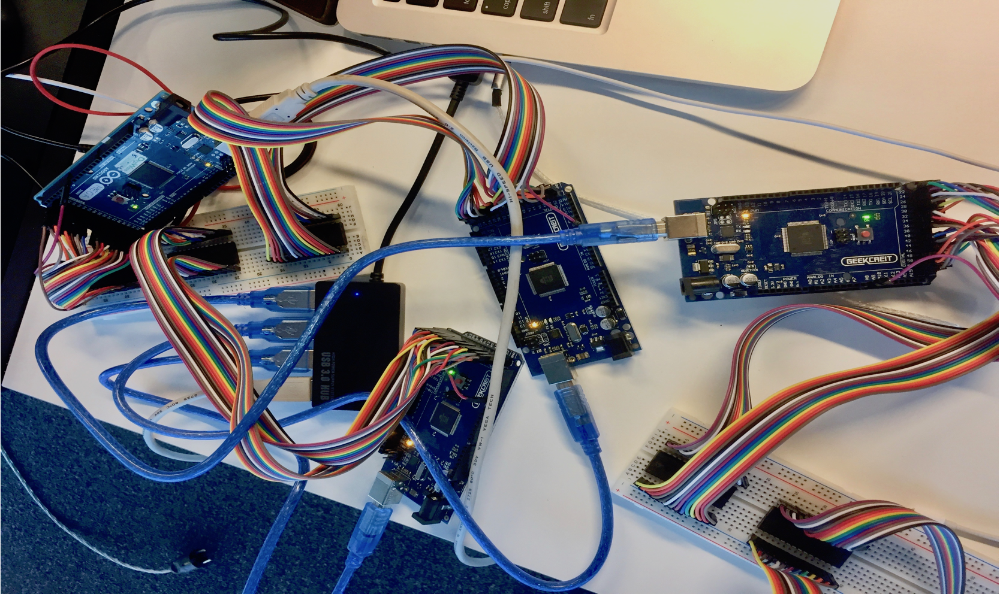
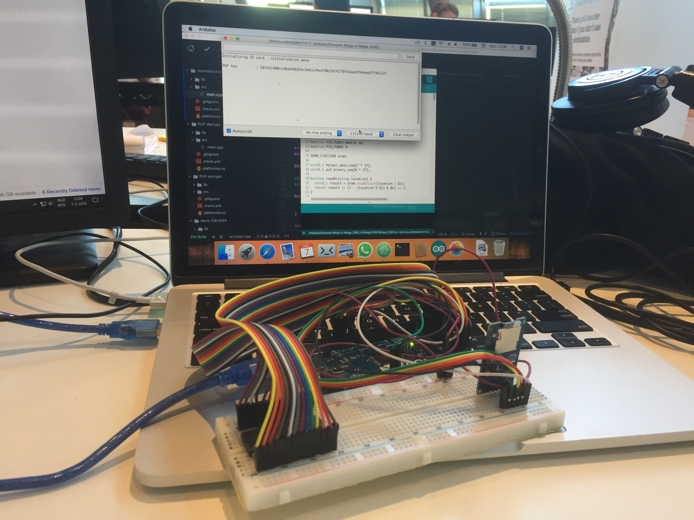

# Software-based Physically Unclonable Function

## README
This repository is dedicated for the first open source software-based Physically Unclonable Function (PUF) using off-the-shelf SRAM.

### Abstract
SRAM PUF has a potential to become the main player in hardware security. Unfortunately, currently available solutions are usually locked to specific entities, such as companies or universities. Here, we introduce the first open source project to develop software-based SRAM PUF technology using off-the-shelf SRAM.
We also present testing results on two off-the-shelf SRAMs quality to be a PUF component; Microchip 23LC1024 and Cypress CY62256NLL.
Testing on two bit-selection algorithms (data remanence analysis and neighbor analysis) are also performed.
Based on the testing results, we introduce a PUF enrollment scheme using data remanence analysis as the bit selection algorithm which will locate the location of the stable bits and SRAM Cypress CY62256NLL as the off-the-shelf SRAM.
Moreover, we also propose a procedure to develop SRAM PUF-based applications using any off-the-shelf SRAM. The procedure consists of three main steps; test the off-the-shelf SRAM quality to be a PUF component, create a PUF-generated key using enrollment-reconstruction mechanism, and develop any PUF-based application utilizing the PUF-generated key.
In addition, an idea to create numerous CRPs using SRAM PUF is also proposed here. Using a collection of stable bits as a challenge, the stable bits are permutated among themselves to create a challenge which has a numerous number of possibilities.
Furthermore, we also present a secure data and key storage scheme using SRAM PUF. The proposed scheme is influenced by multi-factor authentication. Using a combination of a PUF-generated key and user's password, a derived key is produced and utilized as the final key to protect user's data or/and user's key.
As the grand concluding experiment of this thesis, we present a demo of storing
a private key of Bitcoin.
We shows that the Bitcoin key will not be reconstructed successfully if user's
password is incorrect or the SRAM is not similar with the one that use to
encrypt the Bitcoin key.

### Repository structure
There are two folder inside:
- Thesis Report: contains latex files required for the thesis report.
- Source Code: source code for the thesis project and
instructions on how to test SRAMs, perform enrollment, reconstruct PUF-generated key, and use the secure data and key storage scheme. All Arduino code is developed using [platformio](https://platformio.org/platformio-ide). The type of the Arduino is Arduino Mega 2560. The Python code is developed using [PyCharm IDE](https://www.jetbrains.com/pycharm/download/#section=mac).
  - code-coverage: C++ codes for testing using GCOV and LCOV. Developed using CLion.
  - enrollment and testing: source code required for enrollment and testing.
    - master-enrollment: Python code, act as a master for the enrollment scheme
    - master-testing: Python code, act as a master for testing
    - slave-23lc1024: Arduino code, act as a slave for testing Microchip 23LC1024
    - slave-cy62256nll: Arduino code, act as a slave for testing and enrollment on Cypress CY62256NLL
  - key storage scheme: Arduino source code for the secure data protection and key storage scheme. Enrollment has to be performed first before you can use this feature.
    - PUF-decrypt: Arduino code to decrypt the ciphertext using the proposed scheme
    - PUF-encrypt: Arduino code to encrypt user's key using the proposed scheme
  - reconstruction: Arduino source code for reconstruct the PUF-generated key. Enrollment has to be performed first before you can use this feature.
  - schematic: pictures and fzz files which shows how to connect Arduino with SRAM Cypress CY62256NLL and Microchip 23LC1024 for the testing and enrollment. Open the fzz files using [Fritzing](http://fritzing.org/home/).
- Figures: figures showing parallel profiling and key reconstruction using
Arduino, microSD and SRAM Cypress CY62256NLL.
  - Parallel profiling using four SRAMs and four Arduino.
  
  - Key reconstruction.
  
  - Arduino Mega 2560 connected to a microSD and an SRAM Cypress CY62256NLL.
  
