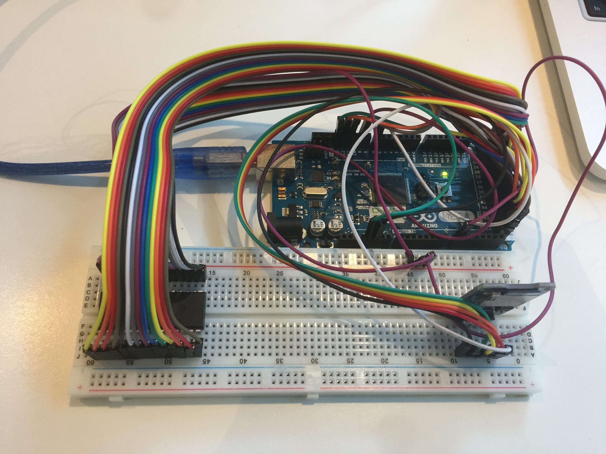

# Software-based Physically Unclonable Function

## README
This repository is dedicated for the first open source software-based Physically Unclonable Function (PUF) using off-the-shelf SRAM.
This project is a part of a master thesis by Ade Setyawan Sajim, TU Delft. All Arduino code in this repository is developed using [platformio](https://platformio.org/platformio-ide). The type of the Arduino is Arduino Mega 2560. The python code is developed using [PyCharm IDE](https://www.jetbrains.com/pycharm/download/#section=mac).

### Abstract
SRAM PUF has a potential to become the main player in hardware security. Unfortunately, the currently available solution is usually locked to specific entities. Here, we introduce the first open source project to develop software-based SRAM PUF technology using off-the-shelf SRAM.
We also present testing results on two off-the-shelf SRAMs quality to be a PUF component; Microchip 23LC1024 and Cypress CY62256NLL.
Testing on two bit-selection algorithms (data remanence analysis and neighbor analysis) are also performed.
Based on the testing results, we introduce a PUF enrollment scheme using data remanence analysis as the bit selection algorithm which will locate the location of the stable bits and SRAM Cypress CY62256NLL as the off-the-shelf SRAM.
Moreover, we also propose a procedure to develop SRAM PUF-based applications using any off-the-shelf SRAM. The procedure consists of three main steps; test the off-the-shelf SRAM quality to be a PUF component, create a PUF-generated key using enrollment-reconstruction mechanism, and develop any PUF-based application utilizing the PUF-generated key.
In addition, an idea to create numerous CRPs using SRAM PUF is also proposed here. Using a collection of stable bits as a challenge, the stable bits are permutated among themselves to create a challenge which has a numerous number of possibilities.
Furthermore, we also present a secure data protection and key storage scheme
using SRAM PUF. The proposed scheme is influenced by multi-factor
authentication. Using a combination of a PUF-generated key and user's password,
a derived key is produced and utilized as the final key to protect user's data
or/and user's key.

### Repository structure
There are two folder inside:
- Thesis Report: contains latex files required for the thesis report
- Source Code: source code for the thesis project.
  - code-coverage: C++ codes for testing using GCOV and LCOV. Developed using CLion.
  - enrollment and testing: source code required for enrollment and testing.
    - master-enrollment: python code, act as a master for the enrollment scheme
    - master-testing: python code, act as a master for testing
    - slave-23lc1024: arduino code, act as a slave only for testing Microchip 23LC1024
    - slave-cy62256nll: arduino code, act as a slave for testing and enrollment on Cypress CY62256NLL
  - key storage scheme: Arduino source code for the secure data protection and key storage scheme.
    - PUF-decrypt: Arduino code to decrypt the ciphertext using the proposed scheme
    - PUF-encrypt: Arduino code to encrypt user's key using the proposed scheme
  - reconstruction: Arduino source code for reconstruct the PUF-generated key.
  - schematic: pictures and fzz files which shows how to connect Arduino with SRAM Cypress CY62256NLL and Microchip 23LC1024 for the testing and enrollment. Open the fzz files using [Fritzing](http://fritzing.org/home/).
- Figures: figures showing parallel profiling and key reconstruction using
Arduino, microSD and SRAM Cypress CY62256NLL.
  - Parallel profiling using four SRAMs and four arduino.
  
  - Key reconstruction.
  
  - Arduino Mega 2560 connected to a microSD and an SRAM Cypress CY62256NLL.
  

### Testing SRAMs
#### Testing off-the-shelf SRAM on voltage variation:
1. Connect Arduino with SRAM Microchip 23LC1024 and step-up-down converter
2. Connect Arduino to PC using USB-to-serial cable
3. Run GetStrongBits.py
4. Set the output of the step-up-down converter to the desired voltage
5. Open GetStrongBitsValue.py, set 'saved_file_name' to the desired strong bits value filename. Run the python file to retrieve the value of strong bits.
6. Repeat step 4 and 5 until there are enough / many strong bits value. Don't
forget to rename the saved bits value file every time
5. Run CalculateQuality.py to check the intra hamming distance of the SRAMs. If
the intra fractional hamming distance is less than 12.8%, this SRAM can be used
for generating the key using the enrollment and reconstruction scheme.
3. Upload slave-23lc1024 project to Arduino
4. Run MainCypress.py from PC. Make sure the serial name and port is correct.

#### Testing Microchip 23LC1024 on time interval:
1. Connect Arduino with SRAM Microchip 23LC1024
2. Connect Arduino to PC using USB-to-serial cable
3. Upload slave-23lc1024 project to Arduino
4. Run MainCypress.py from PC. Make sure the serial name and port is correct.

### Enrollment Scheme
#### Enrollment steps:
1. Connect Arduino with SRAM Cypress CY62256NLL and microSD
2. Connect Arduino to PC using USB-to-serial cable
3. Upload slave-cy62256nll project to Arduino
4. Run MainCypress.py from PC. Make sure the serial name and port is correct.
5. MainCypress.py will locate the strong bits using data remanence analysis, then shuffle those strong bits to generate PUF challenge. Afterwards, the PUF challenge is send to Arduino to be stored in microSD. Later, it will ask Arduino to generate the helper data and stored it in microSD.
6. When finished, microSD will have "challenge.txt" which contains PUF challenge and "helper_data.txt" which filled with helper data.

### Secure Data Protection and Key Storage Scheme
#### Key storage steps:
1. Connect Arduino with SRAM Cypress 62256NLL and microSD.
2. Connect Arduino to PC using USB-to-serial cable.
3. Upload PUF-encrypt project to Arduino.
4. Run the Arduino program by opening the serial port from PC.
5. The program will generate the PUF-generated key.
6. Wait until it ask for user's password.
7. Enter user's password.
8. The program will generate the final key.
9. Wait until it ask for user's key.
10. Enter user's key. It has to be 256-bits (16 characters)
11. The program will encrypt the user's key. The ciphertext will be stored in "encrypted.txt" in microSD.

#### Key reconstruction steps:
1. Connect Arduino with SRAM Cypress 62256NLL and microSD.
2. Connect Arduino to PC using USB-to-serial cable.
3. Upload PUF-decrypt project to Arduino.
4. Run the Arduino program by opening the serial port from PC.
5. The program will generate the PUF-generated key.
6. Wait until it ask for user's password.
7. Enter user's password.
8. The program will generate the final key.
9. The program will decrypt the ciphertext which stored in "encrypted.txt" in microSD.
10. The reconstructed user's key will be printed to the screen.
